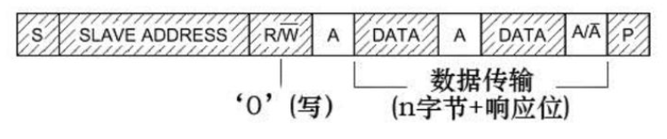
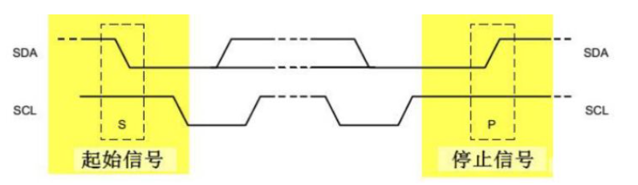
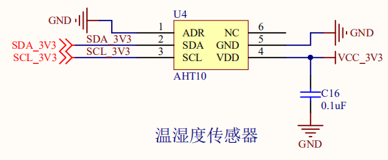

## 简介

本文基于 **EC600S V1.1** 开发板。用于介绍QuecPython I2C模块的使用。 具体关于 QuecPython I2C 的详细的API 请参考 
1. [QuecPython-machine - 硬件相关功能-I2C](https://python.quectel.com/wiki/#/zh-cn/api/QuecPythonClasslib?id=i2c)

文章的主要的是教会你怎样使用Quecpython I2C库， 更多基础的知识，请自行百度 **I2C** 。

### I2C简介
请自行参考 [I2C总线](https://baike.baidu.com/item/I2C%E6%80%BB%E7%BA%BF),更多详细信息不在此赘述。

### I2C 协议基础
以主机向从机写数据为例，其基本结构如图所示，依次为：

**起始信号——从机地址——读写信号——数据位——应答位——… … ——停止位**



- 起始信号（S）：当 SCL 为高电平时，SDA 线从高电平向低电平切换；
- 停止信号（P）：当 SCL 是高电平时，SDA 线由低电平向高电平切换。



帧地址：I2C总线上的每个设备都有自己的独立地址，主机发起通讯时，通过SDA信号线发送设备地址（SLAVE_ADDRESS）来查找从机。I2C协议规定设备地址可以是7位或10位，实际中7位的地址应用比较广泛。

I2C使用SDA信号线来传输数据，使用SCL信号线进行数据同步。SDA数据线在SCL的每个时钟周期传输一位数据。传输时，SCL为高电平的时候SDA表示的数据有效，即此时的SDA为高电平时表示数据“1”，为低电平时表示数据“0”。当SCL为低电平时，SDA的数据无效，一般在这个时候SDA进行电平切换，为下一次表示数据做好准备。

I2C的数据和地址传输都带响应。响应包括“应答（ACK）”和“非应答（NACK）”两种信号。

作为数据接收端时，当设备（无论主从机）接收到I2C传输的一个字节数据或地址后，若希望对方继续发送数据，则需要向对方发送“应答（ACK）”信号，发送方会继续发送下一个数据；若接收端希望结束数据传输，则向对方发送“非应答（NACK）”信号，发送方接收到该信号后会产生一个停止信号，结束信号传输。

### **常见的I2C命令格式**

常见的I2C 总线有如下几种用法。
-   读指定外设、**指定寄存器**的固定长度的数据。
-   读指定外设、**指定起始地址**，指定长度的数据。
-   写指定外设、**指定寄存器**的固定数据。
-   写指定外设、**指定起始地址**，**指定长度**的数据。
-   通过写指定外设的指定寄存器触发某个动作，然后等待外设返回数据。


## 快速开始
在官网资料下载中下载 EC600S 原理图。确定板载温湿度传感器的型号
- **温湿度传感器**

更多关于 **温湿度传感器** 的信息，不在这里讲述，请自行查阅 **[AHT10数据手册](http://www.aosong.com/userfiles/files/media/AHT10%E4%BA%A7%E5%93%81%E6%89%8B%E5%86%8C%20A2%2020201221.pdf)** 数据手册。
下面我们通过I2C总线控制温湿度传感器， 通过查阅手册，可以确定从机地址为 **0x38**。

### 
```python
from machine import I2C


def test_i2c():
    i2c_dev = I2C(I2C.I2C1, I2C.STANDARD_MODE)
    addres = 0x19
    LIS2DH12_WHO_AM_I = 0x0F  # 板载三轴加速度传感器 身份寄存器
    r_data = bytearray([0x00])  # 存储数据
    # 读取指定设备， 指定地址，
    i2c_dev.read(addres, bytearray(LIS2DH12_WHO_AM_I), 1, r_data, 1, 1)
    print("read data lis2dh12 who_am_i reg 0x{0:02x}".format(list(r_data)[0]))
    # 读写寄存器
    LIS2DH12_CTRL_REG2 = 0x21  #
    w_data = [0x04]  # 想要写的数据
    print("write 0x04 to 0x21")
    i2c_dev.write(addres, bytearray(LIS2DH12_CTRL_REG2), 1, bytearray(w_data),
                  len(w_data))
    i2c_dev.read(addres, bytearray(LIS2DH12_CTRL_REG2), 1, r_data, 1, 1)
    print("read 0x{0:02x} from 0x{1:02x}".format(
        list(r_data)[0], LIS2DH12_CTRL_REG2))
    print("test_i2c funcation has exited")
    pass


if __name__ == "__main__":
    test_i2c()
```

上面我们展示了使用 