## 参与贡献
知识共享许可协议
您可以自由地：

分享 — 在任何媒介以任何形式复制、发行本文档。

演绎 — 修改、转换或以本文档为基础进行创作。

只要你遵守许可协议条款，许可人就无法收回你的这些权利。

惟须遵守下列条件：

署名 — 您必须提供适当的证书，提供一个链接到许可证，并指示是否作出更改。您可以以任何合理的方式这样做，但不是以任何方式表明，许可方赞同您或您的使用。

非商业性使用 — 您不得将本文档用于商业目的。

相同方式共享 — 如果您的修改、转换，或以本文档为基础进行创作，仅得依本素材的授权条款来散布您的贡献作品。

没有附加限制 — 您不能增设法律条款或科技措施，来限制别人依授权条款本已许可的作为。

声明：

当您使用本素材中属于公众领域的元素，或当法律有例外或限制条款允许您的使用，则您不需要遵守本授权条款。

未提供保证。本授权条款未必能完全提供您预期用途所需要的所有许可。例如：形象权、隐私权、著作人格权等其他权利，可能限制您如何使用本素材。

## 文档写作规范
Quecpython 欢迎开发者参与到开源社区的贡献中来，本文主要介绍参与Quecpython文档贡献的写作规范，如果贡献者提交文档的修改或提交新的文档，请参照此规范。


### **目录结构**

**teedoc 不建议使用一级标题**，对应文档名称，其他标题名称内容不做限制，**标题不用加序号，**
注意子级标题不要太多。理论上目录支持到六级标题，但是建议到四级标题就ok了。

### **代码块规范**

编码代码的时候请选择高亮语法. 具体请参考 [Markdown 语法说明 (简体中文版)](https://link.zhihu.com/?target=http%3A//www.appinn.com/markdown/)


### **代码链接&图片链接**

下载代码链接相对路径为code/代码名称，图片链接为media/图片名称，代码名称最好下划线组合一下
防止重复，图片名称长一点，可以用生成的图片，也可以用文件名称+序号也是为了防止重复


## 使用SourceTree拉取代码

我们使用的是[github](https://github.com/)提交存储代码, 首先需要安装[git](https://git-scm.com/)，
不过官网的下载速度比较感人，建议到[淘宝-git镜像库](https://npm.taobao.org/mirrors/git-for-windows/)下载最新git客户端，
更多关于git的使用可以参考[廖雪峰的Git教程](https://www.liaoxuefeng.com/wiki/896043488029600/)

**到这里，认为你已经可以安装好了git**

git 属于命令行工具， 不宜使用。 推荐使用git 的gui工具 **SourceTree**。

关于 SourceTree 更多的内容可以在 [Sourcetree | Free Git GUI for Mac and Windows (sourcetreeapp.com)](https://www.sourcetreeapp.com/) 处查看。


###  SourceTree 安装

关于 SourceTree 的安装请参考 [SourceTree安装及卸载 - 爱码网 (likecs.com)](http://www.likecs.com/show-118323.html)


### FORK & 拉取代码

文档仓库地址为 

```bash
https://github.com/quecpython/Community-document
```

首先请注册[GitHub](https://github.com/)账号 , fork  [quecpython/Community-document (github.com)](https://github.com/quecpython/Community-document)仓库。  具体请参考 [Fork 一个仓库 - 简书 (jianshu.com)](https://www.jianshu.com/p/7935afee30e8)


**注意事项**

仓库 的clone 路径是你 自己账户的名称。 比我的账户名称是 youtao-cQ 。  那么我的克隆地址就是如下。 

```
https://github.com/youtao-cQ/Community-document
```


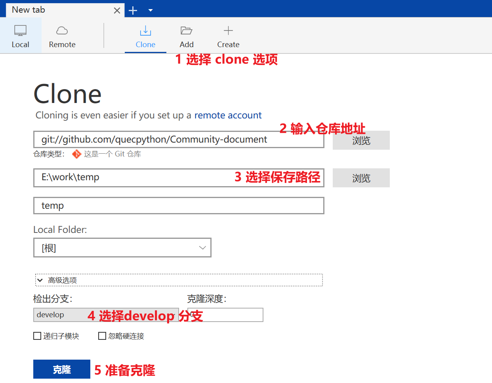


拉取代码以后我们可以看到下面的情形。

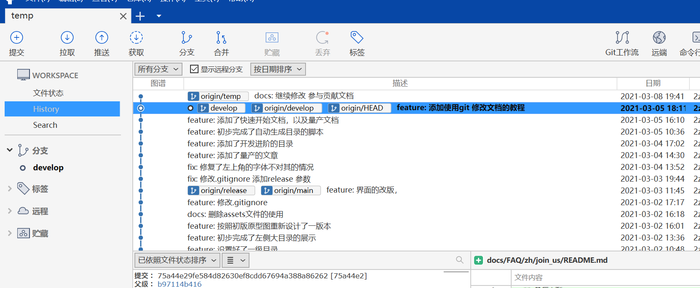


### teedoc 部署& 预览

使用 cmd 或者 powershell 进入 **E:\work\temp**。 当前目录有一个 .git 的隐藏文件夹

```
PS E:\work\temp> dir


    目录: E:\work\temp


Mode                 LastWriteTime         Length Name
----                 -------------         ------ ----
d-----          2021/3/8     22:04                .github
d-----          2021/3/9      9:41                .vscode
d-----          2021/3/8     22:04                docs
d-----          2021/3/8     22:04                pages
d-----          2021/3/8     22:04                static
-a----          2021/3/8     22:04            120 .gitignore
-a----          2021/3/8     22:04           3223 auto_creat_toc.py
...
```

首先请使用 pip3 安装 teedoc.

```
pip3 install teedoc
```


- **安装 teedoc**   插件

```python
PS E:\work\temp\Community-document> teedoc install
```

- **build , 将md 转化成为 html**

```bash
PS E:\work\temp\Community-document> teedoc build
```

- **部署 ** 

```
PS E:\work\temp\Community-document> teedoc serve
2021-03-08 20:42:01 - [INFO] - [Thread-26]:  Starting server at 0.0.0.0:2333 ....
```

- **预览**

我们可以看到映射的端口为2333. 在浏览器中输入 http://127.0.0.1:2333/ 。 就可以访问预览网站了。

```
http://127.0.0.1:2333/
```


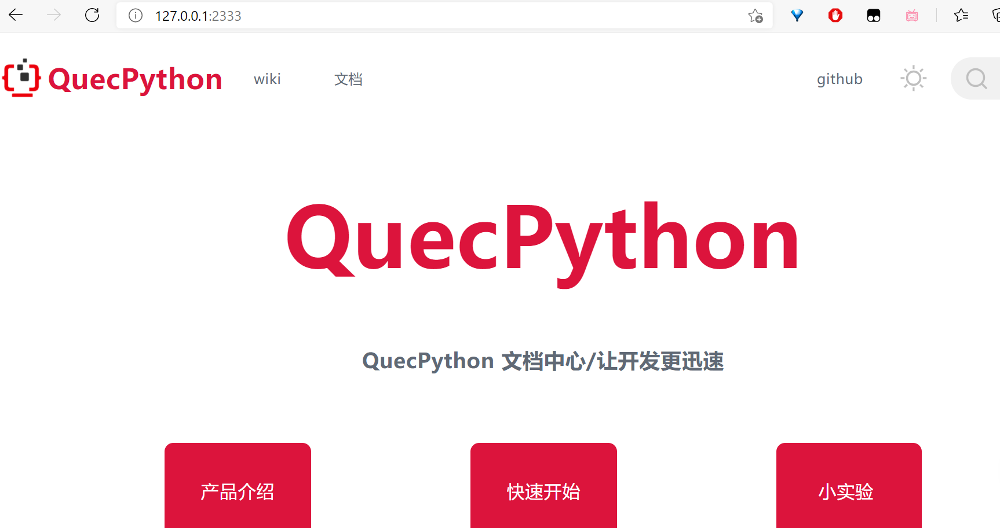


### 小技巧

​      如果仅仅只需要修改 md内容文件， 我们使用   **teedoc serve**部署以后。 修改md文件， 可以实时显示在网页上面，不用重新build。 修改了其他的文件，就需要重新编译。 

## quick start

### 新建一个md文件，然后添加内容

下面我们演示一下，怎样在FAQ文件夹下面新增一篇文章。

#### !！(重要)**同步代码**


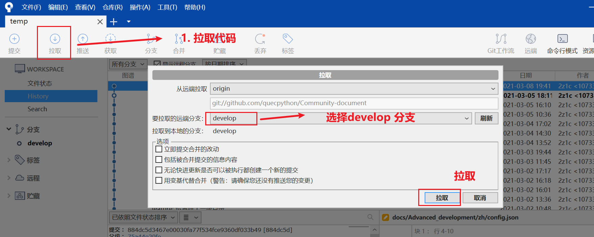

代码同步完成以后， 

#### 新建本地分支，继续新分支修改文档

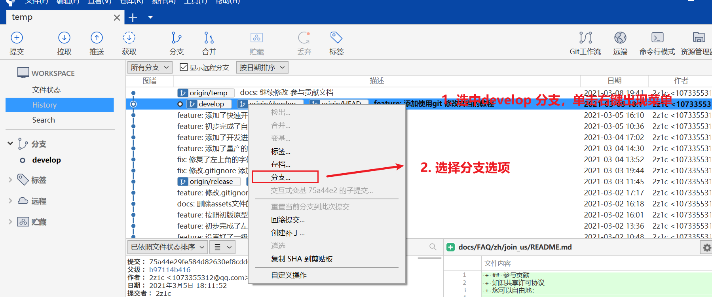


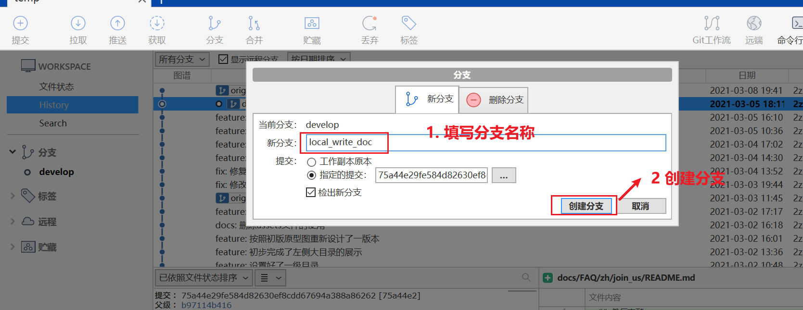

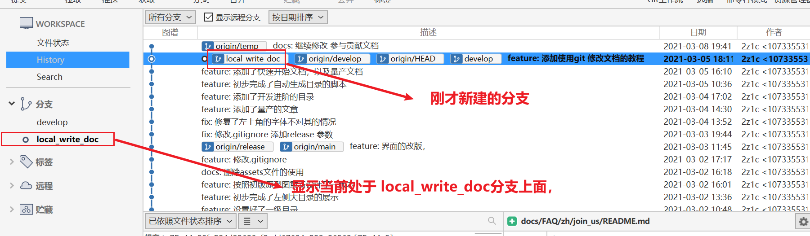

#### **在docs/zh 新建文件夹 以及 md文件**

**`请确认当前是基于刚才新建的本地分支，而不是 develop 分支。`** 

在**docs/zh** 中新建others 文件夹

然后新建一个 md文件命名为 others.md

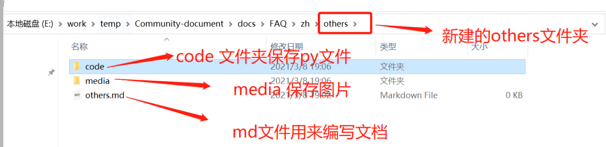


然后我们可以使用[Typora — a markdown editor, markdown reader.](https://www.typora.io/)  软件打开，修改编辑文档。

也可以使用vscode。 


#### **修改侧边栏目录 sidebar.yaml 文件**

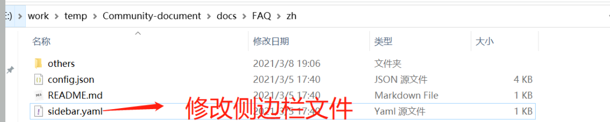

然后修改sidebar.yaml 文件， 添加下面两句

```
  - label: 其他问题
    file: others/others.md
```


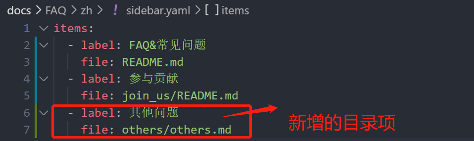


#### 预览

修改完成以后，参考  《本文 teedoc 部署& 预览 章节》，测试查看效果。

最终我们可以在浏览器中看到如下效果

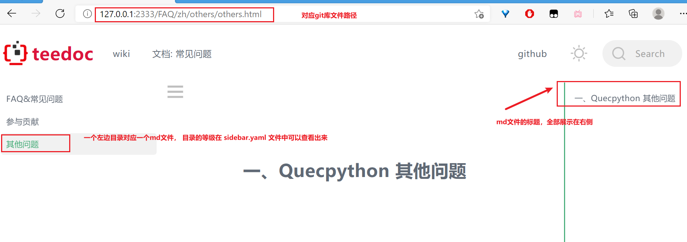

我们修改完成了以后，需要提交代码。

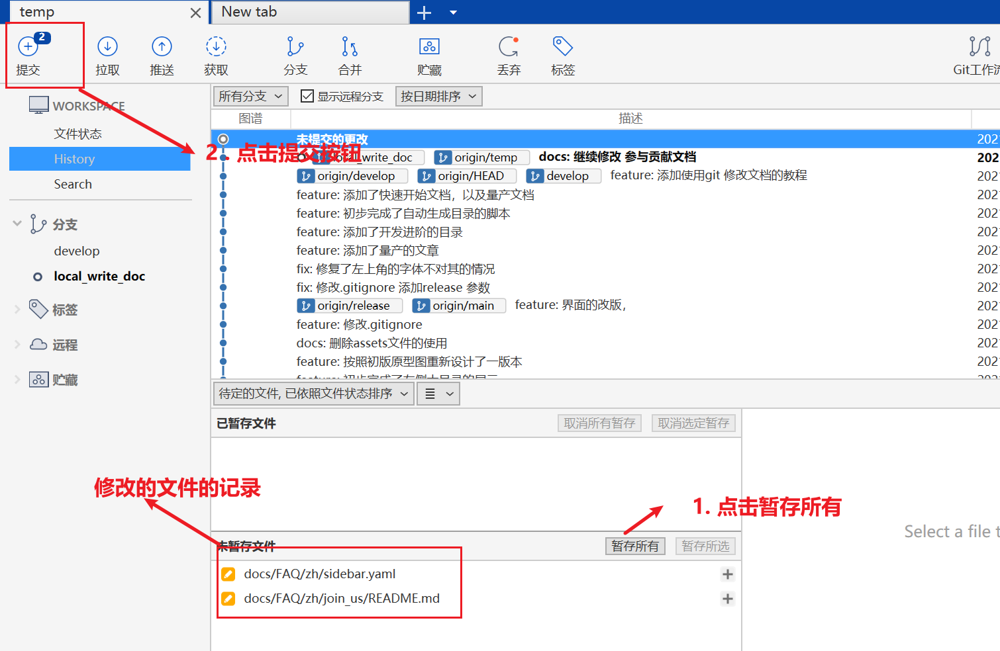

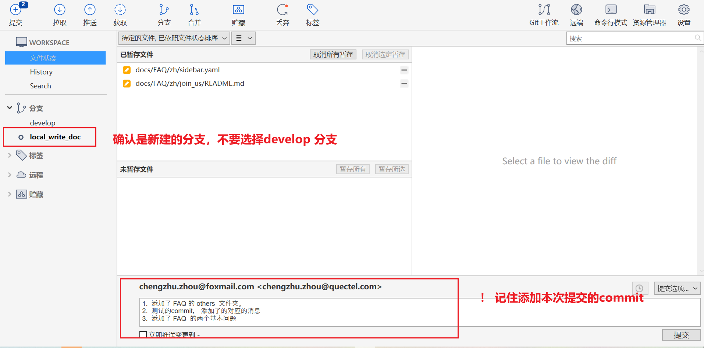

然后点击提交即可。 

最后我们可以在history 状态中看到我们提交的代码

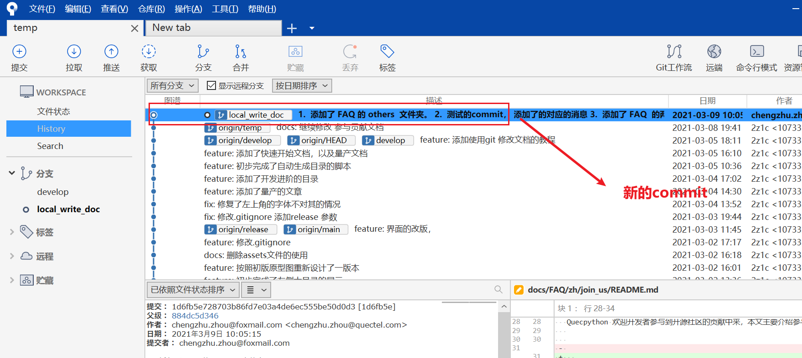


最后我们需要将代码push 我们自己本身的fork 以后的仓库，最后提交到 [quecpython/Community-document (github.com)](https://github.com/quecpython/Community-document)

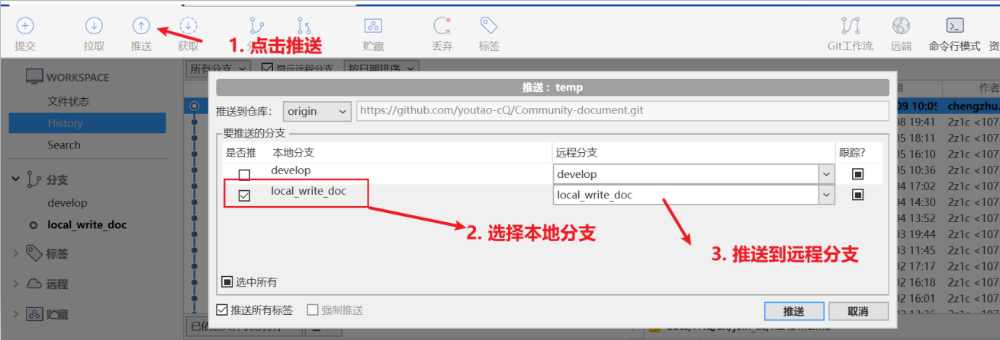


### 提交pull request 

我们在上一节看到提交了本地的commit 到自己的仓库以后。下面我们需要在云端操作，将commit pull 到[quecpython/Community-document (github.com)](https://github.com/quecpython/Community-document)

主仓库，


1. 切换到我们新建的分支。

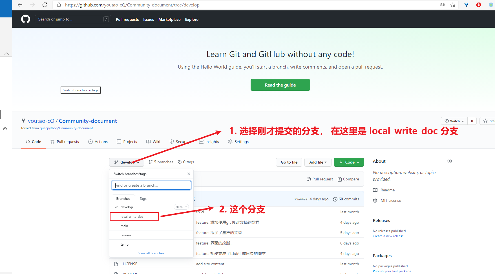


2. 选择 pull request 分支。

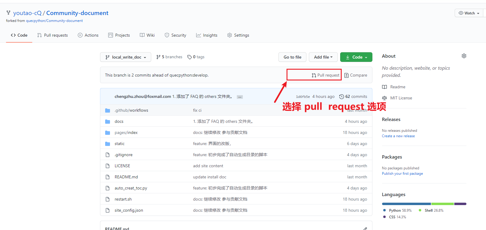


3. 填写评论，提交pull request . 

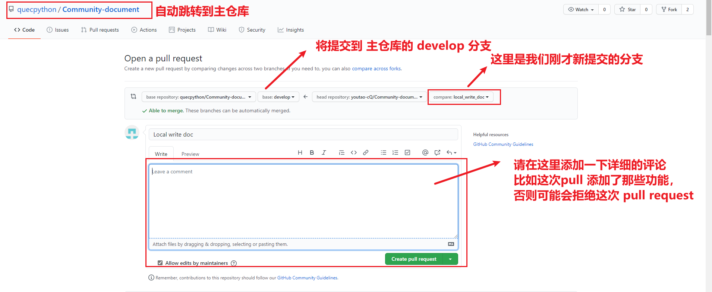


4。 等待主仓库合并

