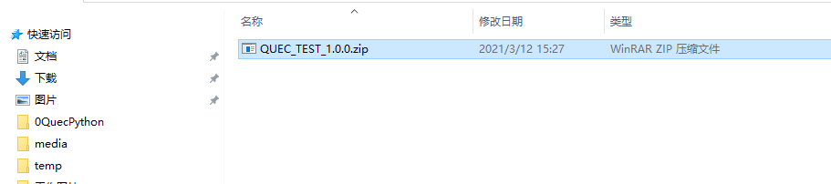

# QuecPython 产品开发及量产方案

本文档主要介绍QuecPython 产品开发及量产方案。

本文档适用于移远通信如下模块：

- EC100Y-CN

- EC600S-CN


## 代码保护

登录官方网站“[资源下载](https://python.quectel.com/download)”，在**“工具”**栏中找到【QPYcom 图形化工具】


打开QPYcom工具后，在**“下载”**选项中有【加密】【备份】的选项。加密功能用于保护用户的APP代码，解密后使源代码被掩盖；备份功能用于投入市场后，若APP意外丢失、被改写等，可从备份区恢复。

## 使用QPYcom生成量产固件包

合并源码后，用户在生产时，只需烧录一次固件即可完成生产，在合并时已经将用户的APP文件嵌入到固件中，因此烧录合并后的固件已经包含了用户的APP文件。

### 合并条件

1、合并的*.py*文件中必须包含*main.py*代码。

2、*main.py*代码中必须包含以下两行语句：

​		PROJECT_NAME = 'QUEC_TEST'  # 必须要有这行代码才能合并

​		PROJECT_VERSION = '1.0.0'  # 必须要有这行代码才能合并

**注意：**

在合并的所有*.py*文件中，*main.py*作为程序入口文件，工具自动不对其加密，故写代码时，从*main.py*调用其他文件的接口更加安全。

### 示例工程

*main.py*文件：

```python
from usr import user_file  # 用户的.py文件放在usr路径下，要用 from usr 导入APP
import utime


PROJECT_NAME = 'QUEC_TEST'  # 必须要有这行代码才能合并
PROJECT_VERSION = '1.0.0'  # 必须要有这行代码才能合并


if __name__ == "__main__":  # 标准写法，从main.py开始执行
    while True:
        user_file.Qprint()
        user_file.Qlistdir()
        utime.sleep_ms(300)

```

*user_file.py*文件：

```python
import uos


def Qprint():
    print('Hello World !')


def Qlistdir():
    print(uos.listdir('/usr'))

```

将以上*main.py* 和*user_file.py*两个文件添加到要合并的*.py*中。固件建议使用官网发布的最新版本：“资源下载”---“资源”---“下载”中找到对应的固件 。

合并后的固件存放在用户指定的路径下，如《QUEC_TEST_1.0.0.zip》文件，文件名由*mian.py*中的变量**PROJECT_NAME**、**PROJECT_VERSION**组合而成。

**注意：**

合并要和模组交互操作，故合并时需要连接模块，打开QuecPython的交互串口，并保证没有程序在运行，即能正常交互，方能合并：


仅需几秒钟，即可完成合并：


合并完成后的文件名是由*mian.py*中的变量**PROJECT_NAME**、**PROJECT_VERSION**组合而成



烧录合并后的固件，开机自动运行*main.py*：


## 量产工具

登录官方网站“[资源下载](https://python.quectel.com/download)”，在**“工具”**栏目中找到【QMulti 批量下载工具】

打开软件后，在**“Load FW Files”**中选择上面合并后的固件，点击**“Auto ALL”**后，即自动检测8个通道直至烧录完毕。


1、夹具通过USB先接入电脑。

2、在电脑打开QMulti 批量下载工具，并选择要烧录的固件，随后软件会自动检测烧录。

3、只要夹具中的任意一个通信有模块接通电源，就会自动烧录。

**注意：**

烧录失败，意外终止时，只需要模块重新上电即可继续烧录。

## 下载配套代码

 <a href="zh-cn/QuecPythonMP/code/main.zip" target="_blank">下载配套代码模板</a>

 <a href="zh-cn/QuecPythonMP/code/fota.zip" target="_blank">下载差分包生成教程和工具</a>


## 失败问题处理

### AT口与USB串口未识别

检查串口驱动是否安装。若安装了驱动，设备管理器界面将显示如下：


### Windows 7安装USB驱动命令交互串口未识别

**现象**：

安装EC100Y-CN模块所需SDK包中的驱动Quectel_ASR_Series_UMTS&LTE_Windows_USB_Driver_Customer_V1.0.3.zip后，出现Windows7下未正常识别出模块的命令交互串口。

**原因**：

Windows7下无法使用Microsoft的USB串行设备驱动程序。

**解决方案**：

详见文档《EC100Y-CN\_Windows7安装USB驱动指令交互串口未识别解决方法》。

### 模块中有脚本文件运行

**现象**：

合并失败，QPYcom烧录固件没有反应

上传py文件且文件名为*main.py*到模块后，无法任何执行指令（包括上传文件等）

**原因**：

模块在开机后会自动寻找运行文件名为*main.py*的脚本文件，如果*main.py*中存在*while*、*for(,,)*这种循环语句，会导致程序阻塞，串口被占用，无法进行其他操作。

**解决方案**：

目前版本只能通过重刷固件解决此问题，建议在测试阶段尽量不要使用*main.py文件，可使用*start.py或其它命名来手动拉起项目，避免重刷固件。


## 附录A参考文档及术语缩写

表1：参考文档

| **序号** | **文档名称**                                            | **备注**                                      |
| -------- | ------------------------------------------------------- | --------------------------------------------- |
| [1]      | Quectel QuecPython_QPYcom_用户指导                      | QPYcom工具使用说明                            |
| [2]      | Quectel_QMulti_DL_用户指导                              | QMulti_DL工具使用说明                         |
| [3]      | EC100Y-CN_Windows7安装USB驱动指令交互串口未识别解决方法 | Windows7安装USB驱动指令交互串口未识别解决方法 |

表2：术语缩写

| **术语** | **英文全称**             | **中文全称**   |
| -------- | ------------------------ | -------------- |
| USB      | Universal Serial Bus     | 通用串行总线   |
| SDK      | Software Development Kit | 软件开发工具包 |

# 