# QuecPython 开发准备

## QuecPython官网介绍及开发资源获取

### 官网介绍

**官网地址： https://python.quectel.com/**


**官网wiki地址：https://python.quectel.com/wiki/#/**


### 开发资源下载

获取开发资源下载地址：https://python.quectel.com/download


## 初识QuecPython开发板

### QuecPython目前支持的平台

**CAT1/CATM/NB**


本文以EC600S_QuecPython_EVB为例进行介绍。

### 开发板介绍

EC600S_QuecPython_EVB_V1.1是专为 EC600S QuecPython开发而设计的一款开发板，其上集成了EC600S-CN 模块、板载 PCB 天线、音频接口、TypeC 接口、NANO SIM 卡座、自定义 KEY、LED 灯、LCD 接口，加速度传感器、温湿度传感器、光敏电阻等开发常用的配置，可以满足开发者的一般开发需求。

### 开发板硬件接口正面


------

### 开发板硬件接口背面


------

### 外设资源库

#### LCD 接口

EC600S_QuecPython_EVB_V1.1开发板集成了 LCD 接口，可以通过 SPI 协议来点亮 LCD 屏幕，其电 路 图 如 下 图 所 示 。QuecPython已 经 适 配 过color_lcd_spi_gc9305 、color_lcd_spi_hx8347、color_std_spi_st7789 和 mono_lcd_spi_st7567，购买开发板时可以选配一块 ST7789 驱动的 1.4 寸彩屏转接板。


#### 加速度传感器

EC600S_QuecPython_EVB_V1.1 开发板集成了三轴加速度传感器，型号为 ST 公司的 LIS2DH12TR。 三轴加速度传感器是基于加速度的基本原理实现工作，具有体积小和重量轻特点。其电路图如下图所示：


#### 光敏电阻

EC600S_QuecPython_EVB_V1.1开发板集成了光敏电阻，型号为 JCHL的GL5516。光敏电阻是用硫化镉或硒化镉等半导体材料制成的特殊电阻器，其工作原理是基于内光电效应。光照愈强，阻值就愈低，随着光照强度的升高，电阻值迅速降低，亮电阻值可小至 1KΩ以下。光敏电阻对光线十分敏感，其在无光照时，高阻状态，暗电阻一般可达1.5MΩ。其电路图如下图所示： 


#### **温湿度传感器** 

EC600S_QuecPython_EVB_V1.1 开发板集成了温湿度传感器，型号为ASAIR的AHT10。温湿度传感器多以温湿度一体式的探头作为测温元件，将温度和湿度信号采集出来，经过稳压滤波、运算放大、非线性校正、V/I 转换、恒流及反向保护等电路处理后，转换成与温度和湿度成线性关系的电流信号或电压信号输出， 也可以直接通过主控芯片进行 485 或 232 等接口输出。其电路图如下图所示：


#### 音箱功率放大器

EC600S_QuecPython_EVB_V1.1 开发板为了满足部分开发者的需求，集成了音响功率放大器，型号为 AWINIC 公司 AW8733ATQR。AW8733ATQR 是一款具有超强 TDD 抑制、超大音量、防破音、超低 EMI、K 类音响功率放大器，输出功率 2.0W。 


#### 自定义按键

EC600S_QuecPython_EVB_V1.1 开发板集成了 2 个自定义 KEY，开发者可以自行开发定义功能。


## QuecPython 开发环境搭建

### 实物到手

拿到板子不知道怎么开始，看到这篇文章就对了。

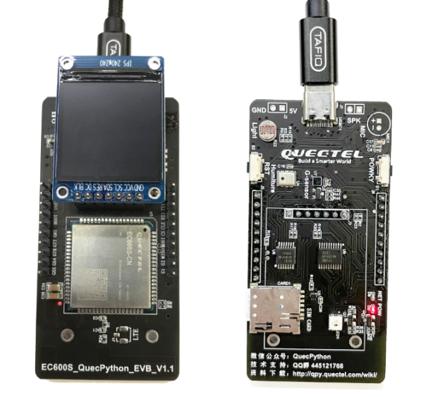

期待已久的板子，终于拿到手了，在开发板侧边插上USB口供电，另一端接电脑USB口。

功能强大的开发板像手机一样支持开关机，所以供电后，我们首先开机。

长按侧边的POWKY两秒松开，模组便会自动开机。

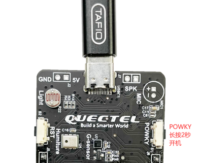

开始玩转QuecPython啦。


### 驱动下载安装

驱动程序（device driver）全称为“设备驱动程序”，是一种可以使计算机和设备通信的特殊程序，可以说相当于硬件的接口，操作系统只能通过这个接口，才能控制硬件设备的工作，假如某设备的驱动程序未能正确安装，便不能正常工作。

 

为了能让EC600S开发板和电脑正常通信，我们去官网下载一个EC600S的驱动程序，安装在电脑上。

下载链接：https://python.quectel.com/download

打开链接，选择自己电脑匹配的驱动，【点击下载】

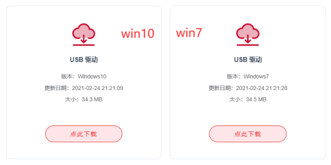

打开【我的电脑】——【管理】——【设备管理器】

安装驱动前：

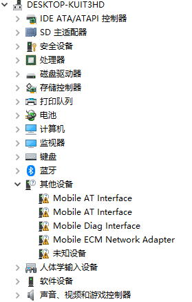

安装驱动后：

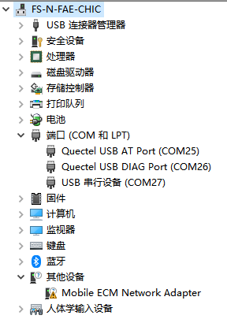

下载后打开压缩包，双击运行“setup.exe”，一直“下一步”直到安装完成，安装完之后就可以看到【设备管理器】中端口的感叹号消失了，说明安装成功，能够正常通信。


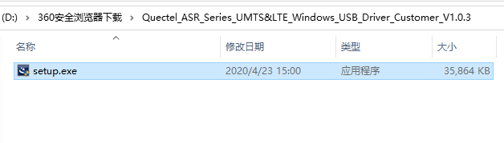

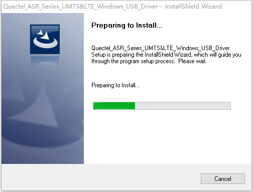


### QPYcom.exe使用

官方提供一个Windows的界面工具给用户开发调试模组的代码。

下载链接：https://python.quectel.com/download

找到QPYcom图形化工具

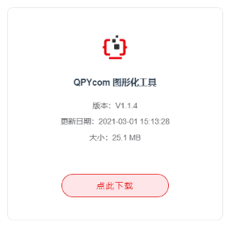

绿色版QPYcom软件无需安装，直接下载解压后，打开QPYcom.exe应用程序使用。


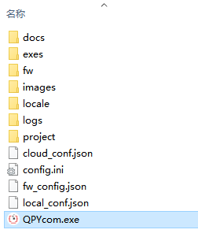

下面介绍一下QPYcom工具的主要内容包括不限于：交互界面、文件操作、下载功能。

交互界面：用于在电脑端与设备端通信，下发命令让设备按照用户的想法去工作，同时设备可以返回信息给电脑，用户在交互界面可以看到设备内部的运作情况。

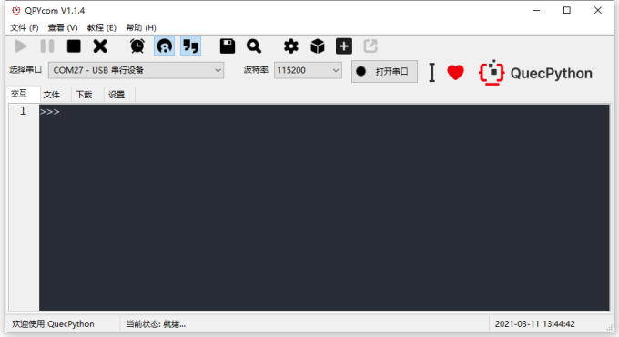

文件操作：用于在电脑端给设备传输文件，用户自己写的代码文件，在这个界面送入到设备，这样设备就能运行用户代码啦。

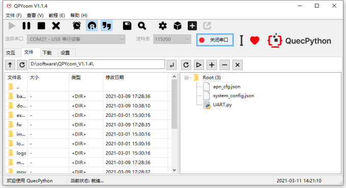

下载功能：用于用户烧录固件，用户的.py文件执行于固件之上，要让设备执行QuecPython代码，就先烧录PY固件。

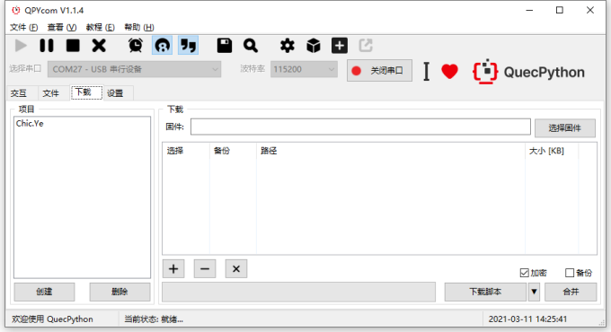

### 工作原理

这里先了解一下整个过程是如何执行的。

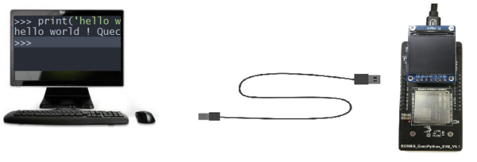

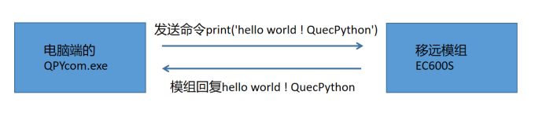

模组内置一个QuecPython语法解释器，对QuecPython语句解释后，返回执行结果。

示例解释：

print(‘Hello world! QuecPython’)

print()是一个函数，通常用来使设备从内部输出一些信息，用户在电脑端了解设备状态。

print()可以打印字符串、变量等等信息。

在QuecPython里字符串用一对单引号表示。如‘Hello world! QuecPython’。


### 实战操作

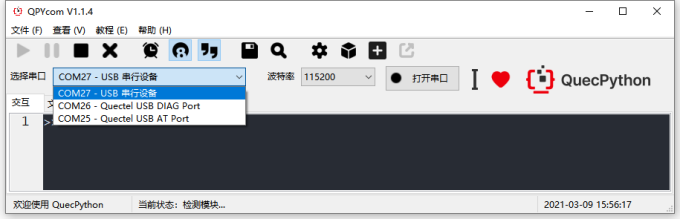

打开QPYcom软件后，我们看到有“选择串口”中有三个端口是模组相关的，其中：

“Quectel USB AT Port”是用于发送AT指令，

“Quectel USB DIAG Prot”用于查看模组的调试信息，	

这两个用户几乎用不到，我们重点留意“***\*USB 串行设备\****”，我们仅用这个端口就可以完成代码的调试工作。

 

点击下拉框，选中“***\*USB串行设备\****”，点击“打开串口”

在交互界面输入print(‘Hello world! QuecPython’)，然后按回车。

看到的界面信息

```python
>>> print('Hello World! QuecPython')

Hello World! QuecPython

>>> 
```

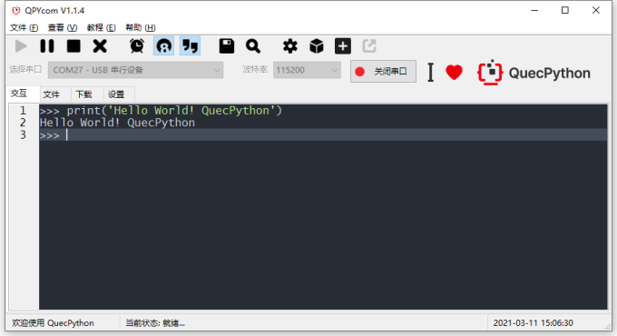

看到模组返回值了，成功输出Hello world! QuecPython

### 其他的API接口

想要了解其他功能可以浏览官方网站：https://python.quectel.com/wiki/#/zh-cn/api/?id=pin

相关工具、例程、驱动、文档可以在官方网站下载：https://python.quectel.com/download

 

了解更多，敬请留意本公众号的精彩内容。


## QuecPython APP开发流程

本文档主要介绍如何使用QuecPython开发出一个完整的APP。

适用模块：

- EC100Y-CN

- EC600S-CN

### 开发流程

通过上一节的学习，已经掌握了电脑和模组的通信工作，那么我们平时是如何开发产品的呢，如何写代码、管理文件呢，这个时候就要安装工具了。

- 安装代码编辑Pycharm；

- 通过QPYcom工具下载.py脚本文件到模块中运行、调试。

- 调试功能代码参考API说明：https://python.quectel.com/wiki/#/zh-cn/api/?id=pin

- 快速体验功能效果可参考demo：https://python.quectel.com/download

  

### 安装编辑工具

接下来介绍如何安装PC端的Python开发环境和pycharm工具

### 安装Python3.9

Python安装包下载地址：https://www.python.org/downloads/

一路下一步直到安装完成，默认路径在：C:\Users\Chic.ye\AppData\Local\Programs\Python\

安装完成后，使用cmd命令窗口输入：python --version

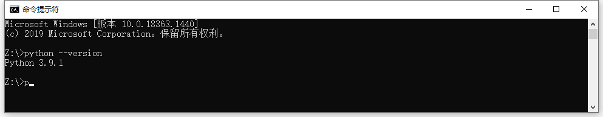

看到返回 Python 3.9.1，说明已经正确安装Python的开发环境

### 安装Pycharm

pycharm安装包在百度网盘下载

链接：https://pan.baidu.com/s/15p1c16UvVOYzhXUzyp7mYg 
提取码：1111 

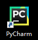

安装完成后双击打开桌面图片，在菜单栏进入“文件”---“默认设置”---设置开发环境

在【Python interpreter】栏目选择python.exe解释器

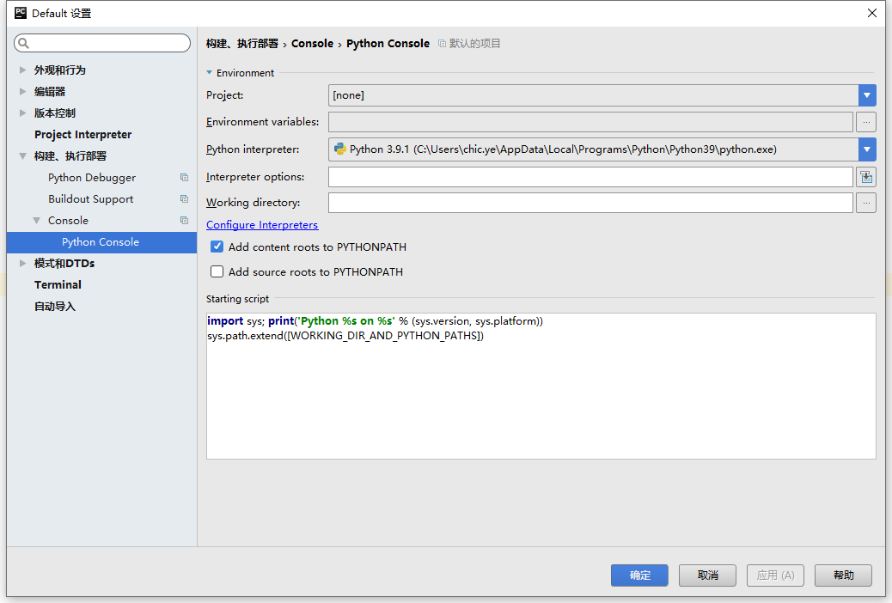


### 设置字体大小

在菜单栏进入“文件”---“设置”---“编辑器”---“颜色和字体”---【Font】和【Console Font】中设置

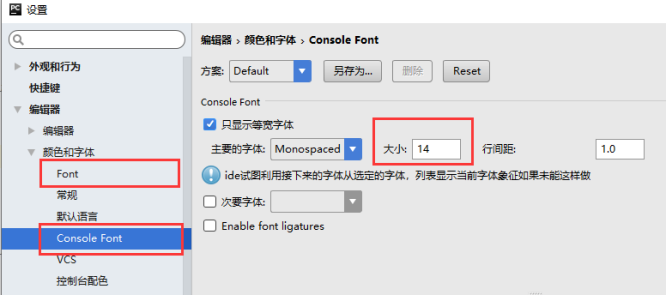


### 使用方法

在菜单栏进入“文件”---“新项目”，然后选中一个文件夹，可以自行在文件夹里新建文件。

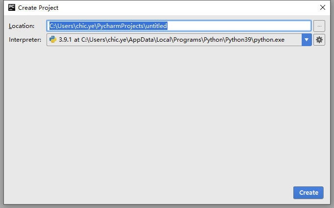

文件或文件内容发生变化之后，pycharm左侧栏目的文件列表随即更新。

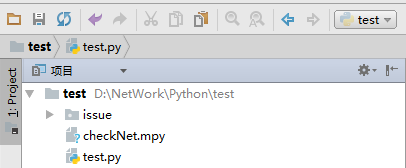

之后就可以在这个文件夹中管理自己的.py文件了。

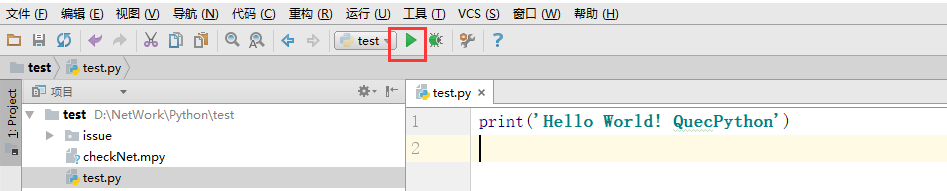

点击项目中的“三角形”，程序便运行起来，在下方有个输出窗口，可以看到print()函数的打印结果。

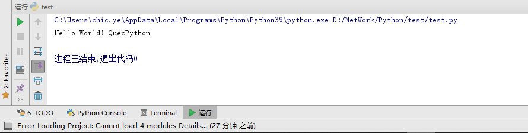

### 在模组中运行代码文件

把上一步编辑好的代码，按照下图步骤，添加到QPYcom工具中，点击“下载脚本”，文件就下载到模组里面了。


在QPYcom工具的【文件】选项卡中选中脚本文件，点击“运行”

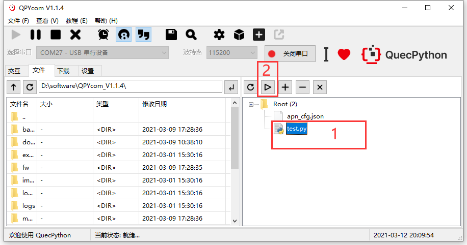

自动跳转至【交互】界面，即可看到模组的执行结果。

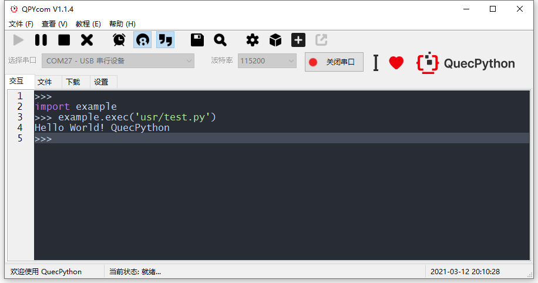

读者会发现在QPYcom的执行结果和模组是一样的，通常我们编写代码是，同样可以在电脑验证业务逻辑或语法，然后再放到模组中执行，这样开发效率就大大提高了。


### 巧用wiki助力开发

遇到不懂的功能开发，可以参考wiki上的API详细介绍，里面有所有功能的接口说明、参数说明。


点击相应的栏目，可以看到API的详细介绍


### 巧用demo快速开发

demo下载地址：https://python.quectel.com/download


下载后，解压出来的文件夹，添加到pycarm项目里面，可以很方便的查看和编辑demo里面的代码了


每一个代码都有注释说明


官网提供的demo非常丰富和完善，帮助客户快速开发产品。